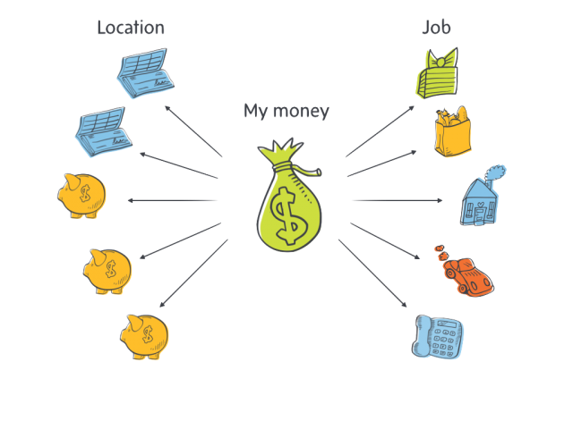
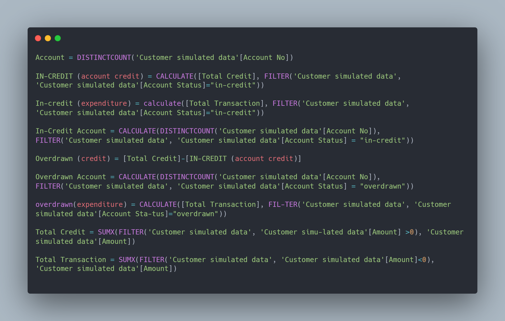
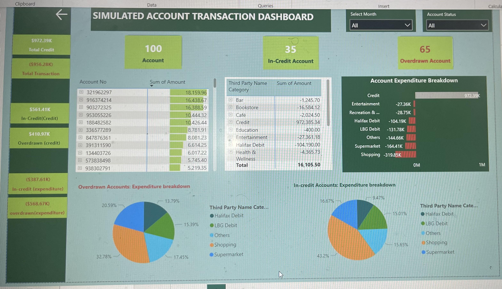

# Simulated-Account-Transactions-Analysis

---

## Introduction

This report presents an analysis of customer transaction data with the objective of enhancing engagement and providing proactive financial assistance. The primary aim is to leverage in-app and email marketing to offer tailored advice and identify customers who may be facing financial challenges or could benefit from new financial products. The insights derived from this analysis aim to shed light on individual customer behaviours, needs and lifestyles, ultimately informing strategies for better customer support and product recommendations.

---

## Objectives

- Proactive Customer Engagement: Lloyds Bank seeks to respond proactively to customers’ needs by providing them with valuable financial advice.
- Personalised Assistance: the objective is to identify customers who may be struggling financially or could benefit from new financial products and offer them personalised support.
- Data-Driven Decision Making: The bank aims to utilised data analysis to gain insights into customer behaviours and needs, enabling more informed decision-making.

---

## Problem Statement

The Bank aims to enhance its customer engagement and support by leveraging data analysis to identify customers’ financial challenges and needs, the problem is to determine how to automatically identify customers who may be struggling financially or could benefit from new financial products based on their transaction data.
Additionally the challenge is to understand customer lifestyles, needs, and behaviours from the available data and use this information to provide tailored assistance.
Finally, the bank seeks to establish a scalable approach to replicate these findings and strategies across its entire customer base.

---

## Data Source and Disclaimer

The dataset used in this project was obtained from Lloyds Bank as part of a data analysis training. It's important to note that this data is simulated and anonymized for educational and training purposes. It does not represent real customer information and has been used solely for the purpose of demonstrating data analysis skills. Privacy and ethical considerations have been upheld throughout the project to protect sensitive information and maintain integrity.

---

## Skills Demonstrated

Power Bi:
- Dashboard
- DAX
- Button
- Filters
- Calculated Column

  ---

  ## DAX Measures Created

  

---

## Insights

**Overview:**
- The dataset includes 100 simulated customer accounts, categorized as either in-credit accounts (35) with positive balances or overdrawn accounts (65) with negative balances.
- Total credit across all accounts is £972.3k, indicating consistent monthly earnings.
- Shopping expenses amount to £319.85k, encompassing a wide range of brands and retailers.
- Supermarket expenditures total £164.4k, with Tesco Express being a significant choice.
- £144.66k in expenses fall into unspecified categories.
- Direct debit transactions from Lloyd's Bank and Halifax account for £131.7k and £104.19k, respectively, suggesting regular financial obligations.
- Recreation and fitness expenses amount to £28.75k, with Grand Union Bjj receiving a significant portion.
- Entertainment expenses contribute £27.36k in debits.

**Overdrawn Accounts:**

**Overdrawn Accounts (Total: 65 accounts):**
- Subcategories include Low Income (28 accounts), Medium Income (12 accounts), No Income (17 accounts), and Unstable Income (8 accounts).

**Low Income Overdrawn Accounts (Total Credit: £192.21k):**
- Predominant expenses include shopping (£89k), particularly at Loosely Fitted, H&M, JD Sports, Topshop, and TK Maxx.
- Tesco is the preferred supermarket.
- Consistent Halifax and Lloyds Bank direct debits indicate monthly financial commitments.

**Medium Income Overdrawn Accounts (Total Credit: £175.4k):**
- A noteworthy portion of expenses is directed towards entertainment and recreation, with recurring "Others" category transactions suggesting monthly payments, possibly for rent.
- Significant shopping expenses (£11.7k) are directed at Loosely Fit, H&M, Topshop, and TK Maxx.
- Lloyds direct debit points to monthly financial commitments.

**unstable Income Overdrawn Accounts (Total Credit: £40.75k):**
- Substantial spending on supermarket and shopping transactions.
- Remarkably consistent allocation to Halifax direct debit amid financial unpredictability.

**No Income Overdrawn Accounts (Total Credit: £0.55k):**
- Despite no recorded income, significant expenses in entertainment, recreation, and substantial direct debits from Halifax and Lloyds Bank suggest financial commitments.
- Raises questions about financial stability and reliance on credit facilities.

**In-credt Accounts:**

There are a total of 35 in-credit accounts, categorized into three subcategories based on income levels: High income (5 accounts), Medium income (23 accounts), and Low income (7 accounts).

**High Income In-Credit Accounts:**
- Total credit income: £129.73k.
- Notable spending on shopping (£23.35k) with preferences for Revella, Loosely Fitted, JD Sport, and H&M.
- Significant direct debits to Lloyds Bank and Halifax, indicating financial responsibility.
- Wise spending habits and prudent financial management despite high income.

**Medium Income In-Credit Accounts:**
- Total credit income: £365.02k.
- Diverse spending habits, reflecting balanced financial resources.
- Major expenses include shopping (£99.93k), supermarket purchases (£37.1k), and direct debits to Halifax and Lloyds Bank.
- Detailed breakdown of shopping preferences, showing significant spending on Loosely Fitted, H&M, JD Sport, and Revella.
- Consistent financial commitment and varied expenses, showcasing a responsible approach to finances.

**Low Income In-Credit Accounts:**
- Total credit income: £67k.
- Thoughtful spending choices despite limited income.
- Primary spending focus on shopping (£30.88k) and supermarket purchases (£12.76k).
- Shopping preferences include Loosely Fitted, Revella, Hobbycraft, H&M, and TK Maxx.
- Notable absence of significant monthly financial commitments like direct debits, indicating careful expense management.

---

## Recommendation

- Host regular financial education workshops or webinars for customers, covering topics like budgeting, saving, and investment. Offer these sessions both in-app and through email invitations to help customers improve their financial literacy.
- Implement automated alerts and notifications for customers who exhibit unusual spending patterns or risk exceeding their overdraft limit. These alerts can serve as proactive reminders and encourage responsible spending.
- Integrate user-friendly savings and investment tools within the banking app to encourage customers, especially those with in-credit accounts, to grow their wealth. Provide recommendations on suitable investment options based on their risk tolerance and financial goals.
- For overdrawn accounts, offer debt consolidation solutions to help customers manage and reduce their debt effectively. Provide information on debt consolidation loans or credit card balance transfer options to simplify their financial situation.
- Partner with credit counselling agencies and offer access to counselling services for customers facing persistent financial challenges. These services can provide personalized debt management plans and strategies.

---

## Visualisation

Please click [here](https://app.powerbi.com/links/ikpFMfM2cL?ctid=e757cfdd-1f35-4457-af8f-7c9c6b1437e3&pbi_source=linkShare) to interact with dashboard.

Thank you!

